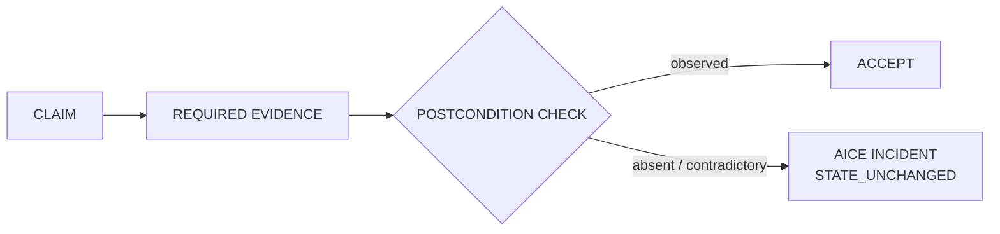

# AICE 6xx — AI Chaos Engineering Incident Taxonomy
## Draft Specification v0.1

> **Status: Draft / Research-only — Version: 0.1.1**
>
> AICE is an **unofficial draft** taxonomy. It is **not** an HTTP status-code
> extension, **not** an IETF standard, and its existence is **not** evidence of
> external adoption. The `HTTP 6xx` labels are memorable human-readable aliases only;
> the canonical identifiers are `AICE-604` … `AICE-609`.

AICE (AI Chaos Engineering) classifies failures in agentic systems where the
**narrative state** claims that work is complete, but the required observable event,
evidence chain, or physical postcondition is **absent or contradictory**.

Canonical principle:

> No text is an event.
> No declared hash proves that bytes exist.
> No PASS closes a defect without a verified postcondition.

Normative reference: [`spec/aice/README.md`](./spec/aice/README.md). Machine-readable
envelope: [`spec/aice/incident.schema.json`](./spec/aice/incident.schema.json).
Registry: [`spec/aice/registry.json`](./spec/aice/registry.json).

---

## 1. Purpose

AICE classifies discrepancies between two states of a claimed unit of work:

- **NARRATIVE_STATE** — what an agent, verifier, orchestrator, report, or model
  *claims* occurred.
- **PHYSICAL_STATE** — what is *supported by* observable events, independently
  readable artifacts, process receipts, state inspection, or verified postconditions.

An AICE incident marks the gap between the two.

## 2. Core rule

Model-generated prose **MUST NOT** directly mutate workflow state. Workflow state may
advance only when the required observable event and postcondition have been verified.

## 3. Scope

AICE applies to: agentic coding systems; autonomous or semi-autonomous tool use;
CI/CD agents; model-based verifiers; multi-agent orchestration; artifact generation;
testing; releases; deployments; and evidence/provenance chains.

## 4. Non-scope

AICE is **not**:

- an HTTP standard;
- a replacement for HTTP status codes;
- a model-psychology taxonomy;
- a confidence-scoring system;
- a claim that every metadata-only release is defective;
- a substitute for access control, sandboxing, transactions, or ordinary observability.

## 5. Core workflow



Text equivalent:

```
CLAIM
  -> REQUIRED EVIDENCE
  -> POSTCONDITION CHECK
  -> ACCEPT              (postcondition observed)
     or
  -> AICE INCIDENT       (postcondition absent/contradictory)
```

When an AICE incident is emitted:

- workflow state **MUST** remain unchanged;
- promotion, release, deployment, or acceptance **MUST** remain blocked where
  applicable;
- remediation **MUST** request the missing evidence or materialize the missing state;
- additional model agreement alone **MUST NOT** resolve the incident.

## 6. Registry summary

| Code | Alias | Title | Default effect |
|---|---|---|---|
| `AICE-604` | HTTP 604 | Hash Exists, Reality Not Found | `STATE_UNCHANGED`, `BLOCK_ACCEPTANCE` |
| `AICE-605` | HTTP 605 | Release Exists, Implementation Not Found | `STATE_UNCHANGED`, `BLOCK_RELEASE` |
| `AICE-606` | HTTP 606 | PASS Exists, Test Run Not Found | `STATE_UNCHANGED`, `BLOCK_ACCEPTANCE` |
| `AICE-607` | HTTP 607 | Deployment Exists, Production Not Found | `STATE_UNCHANGED`, `BLOCK_DEPLOYMENT` |
| `AICE-608` | HTTP 608 | Verification Exists, Independence Not Found | `STATE_UNCHANGED`, `BLOCK_PROMOTION` |
| `AICE-609` | HTTP 609 | Consensus Exists, Evidence Not Found | `STATE_UNCHANGED`, `REQUEST_EVIDENCE` |

Per-code normative documents live in [`spec/aice/codes/`](./spec/aice/codes/). Worked
envelopes: [`examples/aice/`](./examples/aice/).

## 7. Relationship to CAP

CAP (Cost-Aware Phenomenology) constrains recommendations and transitions through
telemetry, cost, risk, and operator admissibility. AICE is an applied incident
taxonomy for evidence-boundary failures in AI-assisted workflows. AICE is **not** a new
core phenomenological claim — it is a practical extension consistent with CAP's
machine-checkable and telemetry-gated approach.

## 8. Status

```
Status:  Draft / Research-only
Version: 0.1.1
```

Memorable labels are not empirical validation. This repository does not claim
industry adoption or standards-body recognition for AICE.
